# 核心流程梳理

### 主要流程函数

- **RunAsync**：总调度，分三步
  1. `RunPreCopy`：准备数据，部分rank与邻居先做一次规约或拷贝
  2. `RunAllReduceHDOptim`：主规约过程，分多步，每步与不同邻居通信
  3. `RunFinalStep`：处理非2的幂次时的收尾

### 关键数据结构

- **userMemIn**：用户输入数据
- **outputMem_**：算法内部buffer，存放中间结果
- **userMemOut**：最终输出
- **links**：与其他rank的通信链路
- **meshStreams_**：多stream支持

### 以4个NPU为例（rankSize=4, base=2, nSteps=2）

- 每个NPU初始有自己的输入数据
- 目标：所有NPU最终都拿到全局规约（如sum）结果

# 4个NPU的AllReduce通信过程

### 步骤分解

#### 步骤0：数据准备（RunPreCopy）

- 每个NPU把自己的输入数据拷贝到outputMem_
- 某些NPU与邻居先做一次规约或数据交换

#### 步骤1：第一次规约（step=1）

- 每个NPU与“距离为1”的邻居（rank异或1）交换数据并做规约
- 结果写入outputMem_的下一个offset

#### 步骤2：第二次规约（step=2）

- 每个NPU与“距离为2”的邻居（rank异或2）交换数据并做规约
- 结果写入outputMem_的下一个offset

#### 步骤3：结果输出（RunFinalStep）

- 最终结果写入userMemOut

# 图文结合展示

### NPU编号与初始数据

| Rank | NPU  | 初始数据（userMemIn） |
| ---- | ---- | --------------------- |
| 0    | NPU0 | A                     |
| 1    | NPU1 | B                     |
| 2    | NPU2 | C                     |
| 3    | NPU3 | D                     |

---

### 通信与数据流动时序图

#### 步骤0：数据准备

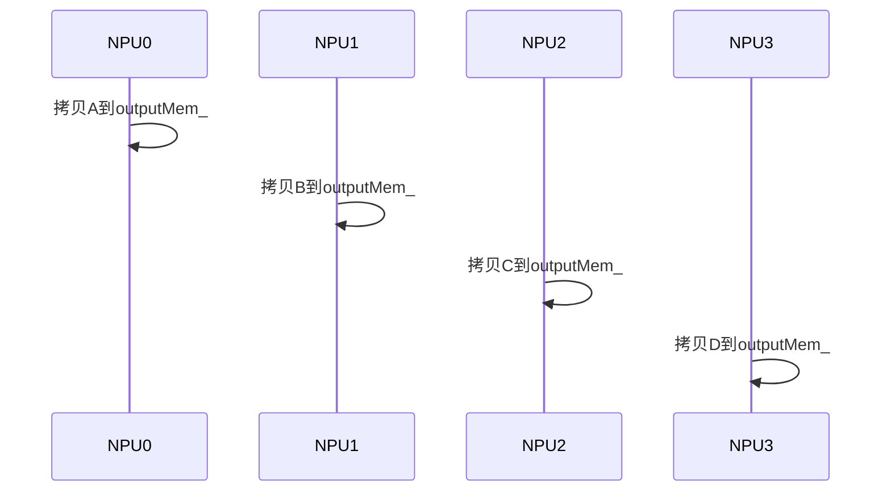

---

#### 步骤1：第一次规约（step=1, 邻居=rank^1）

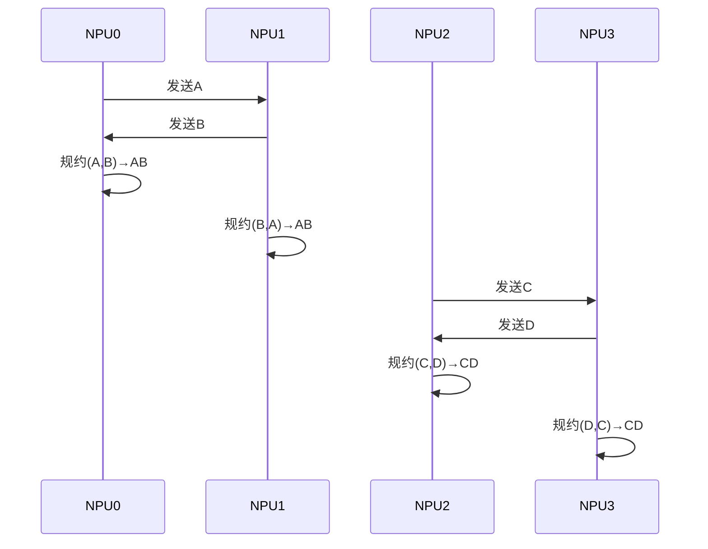

---

#### 步骤2：第二次规约（step=2, 邻居=rank^2）

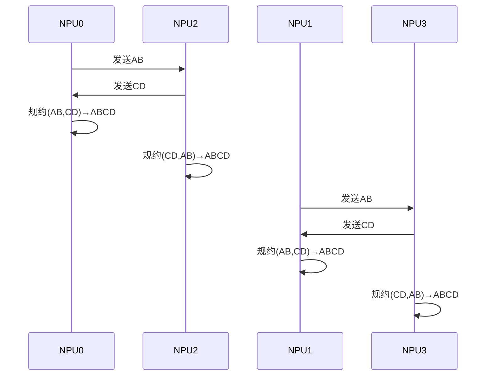

---

#### 步骤3：结果输出

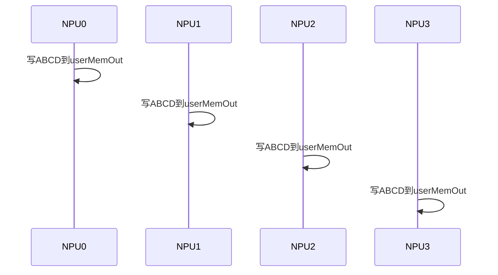

---

### 总结性数据流图

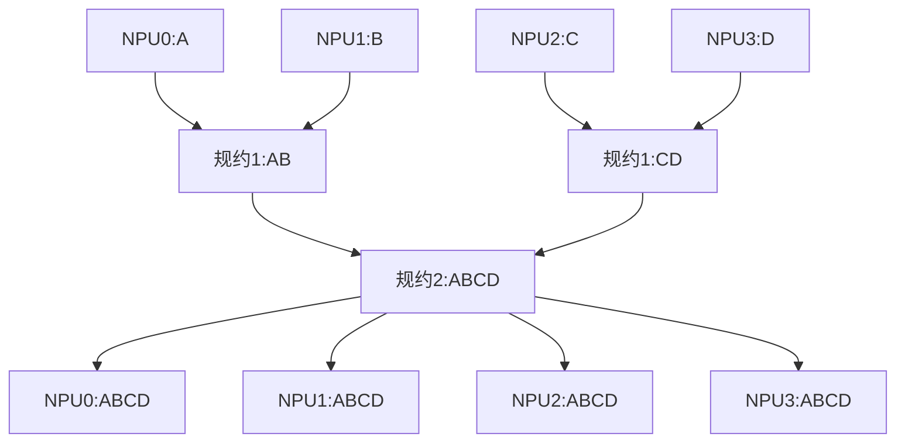

# 代码分析

## 数据准备（RunPreCopy）——逐段分析

### 计算总数据量

```cpp
u32 totalSize = SIZE_TABLE[dataType_] * count_;
```

**解释**：  

- 计算本次AllReduce每个rank需要处理的数据总字节数。
- `SIZE_TABLE[dataType_]` 表示每个元素的字节数，`count_`是元素个数。

> cout_来源：
>
> - 测试程序会根据 -b/-e 计算每次 AllReduce 操作要处理的数据总字节数，比如 512k = 524288 字节。
> - 然后结合 -d fp32（数据类型，float32，每个元素4字节），计算元素个数：
>
> ```c++
>   count = 数据总字节数 / 单元素字节数
>         = 524288 / 4
>         = 131072
> ```
>
> - 这个 count 会被写入 HcomCollOpInfo 结构体的 count 字段，最终赋值给 AllReduce 算法对象的 count_。

---

### 构造本地内存视图

```cpp
DeviceMem src = userMemIn.range(0, totalSize);
DeviceMem dst = outputMem_.range(0, totalSize);
DeviceMem nextDst = outputMem_.range(totalSize, totalSize);
```

**解释**：  

- `src`：指向本rank输入数据的内存区域（userMemIn）。
- `dst`：指向本rank内部buffer的首段（outputMem_）。
- `nextDst`：指向内部buffer的下一个offset（为后续步骤做准备）。

- 这三行代码不会新分配内存，而是基于已有的内存（userMemIn、outputMem_）创建“视图”或“子区间”。

- 这些 DeviceMem 对象只是指向原有内存的某一段，方便后续操作。
- userMemIn.range(0, totalSize)

→ 指向用户输入数据的首地址，长度为 totalSize 字节。

- outputMem_.range(0, totalSize)

→ 指向算法内部 buffer（outputMem_）的首地址，长度为 totalSize 字节。

- outputMem_.range(totalSize, totalSize)

→ 指向 outputMem_ 的下一个 offset（即从 outputMem_ 的 totalSize 字节处开始，长度为 totalSize 字节）。

- 这样做的好处是：可以方便地对同一块大内存的不同“段”进行操作（如拷贝、规约），而不用频繁分配/释放内存。

- 这些“视图”可以直接传递给底层的 memcpy、reduce 等操作函数。

---

### 判断是否为2的幂次

```cpp
if (stepPow == rankSize) {
    CHK_RET(HcclD2DMemcpyAsync(dispatcher_, nextDst, src, stream_)); //这行代码的作用是：在设备（NPU）内存之间，异步拷贝一段数据。具体来说，是把 src 指向的内存内容，拷贝到 nextDst 指向的内存区域。
    return HCCL_SUCCESS;
}
```

**解释**：  

- 如果rank数是2的幂（如4），直接把输入数据拷贝到outputMem_的nextDst位置。
- 这一步没有与其他rank的通信，仅本地拷贝。
- stepPow 是 pow(base, nSteps)，其中 base=2，nSteps=log2(rankSize)。

- 所以 stepPow == rankSize 只有在 rankSize 是2的整数次幂时成立（比如4、8、16等）。

---

### 计算邻居rank

```cpp
u32 neighCur = rank ^ (1 << nSteps);
```

**解释**：  

- 计算本rank在本步需要通信的邻居rank编号。
- 通过异或操作，找到“距离为2^nSteps”的邻居。

---

### 判断邻居是否有效

```cpp
if (neighCur < rankSize) {
    // ...后续分支
}
```

**解释**：  

- 如果邻居编号在有效范围内，说明本rank需要与该邻居通信。
- 否则，后续只做本地拷贝。

---

### 分支1：大编号rank先做规约

```cpp
if (rank >= pow(base, nSteps)) {
    CHK_PTR_NULL(links[neighCur]);
    CHK_RET(links[neighCur]->RxAck(stream_));
    void *remMemPtr = nullptr;
    CHK_RET(links[neighCur]->GetRemoteMem(UserMemType::OUTPUT_MEM, &remMemPtr));
    dst = DeviceMem::create(static_cast<u8 *>(remMemPtr), totalSize);
    CHK_RET(HcclReduceAsync(dispatcher_,
        static_cast<void *>(src.ptr()),
        count_,
        dataType_,
        reductionOp_,
        stream_,
        static_cast<void *>(dst.ptr()),
        links[neighCur]->GetRemoteRank(),
        links[neighCur]->GetLinkType(),
        INLINE_REDUCE_BIT));
    CHK_RET(links[neighCur]->TxDataSignal(stream_));
}
```

**解释**：  

- 如果本rank编号较大（如rank=2,3），先等待邻居的ack（RxAck）。
- 获取邻居的outputMem_地址，准备把规约结果写到邻居buffer。
- 执行规约（HcclReduceAsync）：本地数据和邻居数据做规约，结果写到邻居buffer。
- 通知邻居数据已写好（TxDataSignal）。

---

### 分支2：小编号rank只做拷贝和同步

```cpp
else {
    CHK_RET(HcclD2DMemcpyAsync(dispatcher_, dst, src, stream_));
    CHK_RET(links[neighCur]->TxAck(stream_));
    CHK_RET(links[neighCur]->RxDataSignal(stream_));
    CHK_RET(HcclD2DMemcpyAsync(dispatcher_, nextDst, dst, stream_));
}
```

**解释**：  

- 如果本rank编号较小（如rank=0,1），只需把输入数据拷贝到outputMem_。
- 通知邻居可以开始（TxAck），等待邻居数据写好（RxDataSignal）。
- 再把outputMem_拷贝到nextDst，为后续步骤做准备。

> ---
>
 结合4个NPU的例子（rank=0,1,2,3）
>
> 假设此时在**RunPreCopy**阶段，且不是2的幂次的特殊分支（即走到了这段代码）。
>
> - `src`：userMemIn.range(0, totalSize)（本NPU的输入数据）
> - `dst`：outputMem_.range(0, totalSize)（本NPU内部buffer的首段）
> - `nextDst`：outputMem_.range(totalSize, totalSize)（本NPU内部buffer的第二段）
> - `neighCur`：通过 `rank ^ (1 << nSteps)` 计算得到的邻居rank
>
> ---
>
 每一步的具体含义
>
> ### 第一步：本地拷贝
>
> ```cpp
> CHK_RET(HcclD2DMemcpyAsync(dispatcher_, dst, src, stream_));
> ```
>
> - **作用**：把本NPU的输入数据拷贝到 outputMem_ 的首段。
> - **举例**：NPU0 把自己的数据A拷贝到 outputMem_ 的首段。
>
> ---
>
> ### 第二步：通知邻居
>
> ```cpp
> CHK_RET(links[neighCur]->TxAck(stream_));
> ```
>
> - **作用**：通过通信链路，通知邻居NPU“我准备好了，可以开始了”。
> - **举例**：NPU0 通知它的邻居NPU2（假设 neighCur=2）。
>
> ---
>
> ### 第三步：等待邻居数据写好
>
> ```cpp
> CHK_RET(links[neighCur]->RxDataSignal(stream_));
> ```
>
> - **作用**：等待邻居NPU完成它的数据写入（比如规约或拷贝），保证数据同步。
> - **举例**：NPU0 等待NPU2的数据写好。
>
> ---
>
> ### 第四步：再次本地拷贝
>
> ```cpp
> CHK_RET(HcclD2DMemcpyAsync(dispatcher_, nextDst, dst, stream_));
> ```
>
> - **作用**：把 outputMem_ 的首段数据再拷贝到 outputMem_ 的第二段（nextDst）。
> - **举例**：NPU0 把 outputMem_ 的首段（A）拷贝到第二段，为后续规约做准备。
>
> ---
>
 这一步在4NPU例子中的作用
>
> - **本地数据准备**：每个NPU先把自己的输入数据拷贝到 outputMem_ 的首段。
> - **同步与通信**：通过 TxAck 和 RxDataSignal，和邻居NPU进行同步，确保数据写入顺序正确。
> - **多段布局**：再把首段数据拷贝到第二段，为后续 AllReduce 步骤（比如分步规约、流水线等）做内存布局准备。

---

### 分支3：没有有效邻居，只做本地拷贝

```cpp
else {
    CHK_RET(HcclD2DMemcpyAsync(dispatcher_, dst, src, stream_));
    CHK_RET(HcclD2DMemcpyAsync(dispatcher_, nextDst, dst, stream_));
}
```

**解释**：  

- 如果没有有效邻居（如rank数不是2的幂），只做本地拷贝。

好的，我们继续进入**第二步：第一次规约**，结合4个NPU的例子，详细分析对应的代码和数据流动。


## 第一次规约（RunAllReduceHDOptim，step=1）

### 相关代码位置

在 `RunAsync` 里，经过 `RunPreCopy` 后会进入：

```cpp
if (rank < stepPow) {
    ret = RunAllReduceHDOptim(rank, rankSize, links);
    // ...
}
```

### RunAllReduceHDOptim 关键流程

我们关注第一次循环（step=1）：

```cpp
u32 neighCur = rank ^ (1 << 0); // 第一次规约，邻居是rank异或1
CHK_RET(links[neighCur]->TxAck(stream_));
CHK_RET(links[neighCur]->RxAck(stream_));

for (u32 step = 1; step <= nSteps; step++) {
    // ... 省略部分代码 ...
    CHK_RET(links[neighCur]->GetRemoteMem(UserMemType::OUTPUT_MEM, &remMemPtr)); //通过通信链路 links[neighCur]，获取邻居NPU的 outputMem_ 的地址，并把这个地址写到 remMemPtr 变量里。UserMemType::OUTPUT_MEM 指定要获取的是对方的 outputMem_ 区域。


```

```    src = DeviceMem::create(static_cast<u8 *>(remMemPtr) + (step - 1) * totalSize, totalSize);
    if ((step == 1) && (stepPow == rankSize)) {
        src = userMemIn.range(0, totalSize);
        dst = DeviceMem::create(static_cast<u8 *>(remMemPtr) + totalSize, totalSize);
    }

```

这行代码的作用是**构造一个指向远端NPU内存的“视图”**，用于后续的数据规约操作。

1. 参数含义

- `remMemPtr`：通过上一句 `GetRemoteMem` 获取到的**邻居NPU的 outputMem_ 的基地址**。
- `(step - 1) * totalSize`：表示**在远端 outputMem_ 上的偏移量**，每个 step 对应 outputMem_ 的不同“段”。
- `totalSize`：每一段的字节数。

2. 这行代码做了什么？

- `static_cast<u8 *>(remMemPtr) + (step - 1) * totalSize`  
  → 把远端 outputMem_ 的基地址，**加上 (step-1) 段的偏移**，指向 outputMem_ 的第 step 段。
- `DeviceMem::create(..., totalSize)`  
  → 创建一个 DeviceMem 对象，**代表远端 outputMem_ 的第 step 段，长度为 totalSize**。

3. 作用

- 这样做的目的是：**后续的规约操作（如 HcclReduceAsync）可以直接用 src 作为输入，读取邻居NPU outputMem_ 的第 step 段的数据**。
- 这保证了每一步 AllReduce 规约时，能正确地访问到远端NPU的中间结果。

4. 举例说明（以4NPU为例，step=1）

- 假设 remMemPtr 是 NPU1 的 outputMem_ 的基地址，totalSize=512KB。
- step=1 时，偏移为 0，src 指向 NPU1 outputMem_ 的首段。
- step=2 时，偏移为 1*512KB，src 指向 NPU1 outputMem_ 的第二段。

---


```c++
    CHK_RET(HcclReduceAsync(dispatcher_,
        static_cast<void *>(src.ptr()),
        count_,
        dataType_,
        reductionOp_,
        stream_,
        static_cast<void *>(dst.ptr()),
        links[neighCur]->GetRemoteRank(),
        links[neighCur]->GetLinkType(),
        INLINE_REDUCE_BIT));
    // ... 省略后续代码 ...
}
```

1. 参数含义

- `dispatcher_`：调度器对象，负责调度本次规约操作。
- `src.ptr()`：**输入数据的指针**，这里是“远端NPU outputMem_ 某段”的地址（见上一步）。
- `count_`：规约元素个数（比如 131072）。
- `dataType_`：数据类型（如 fp32）。
- `reductionOp_`：规约操作类型（如 sum、max）。用户在命令行指定 -o sum、-o max 等参数。
- `stream_`：在哪个 stream 上异步执行。
- `dst.ptr()`：**输出数据的指针**，本地 outputMem_ 某段的地址。


 dst 的来源
>
> 在 `RunAllReduceHDOptim` 的 for 循环中，`dst` 的赋值如下：
>
> ```cpp
> if ((step != nSteps) || (stepPow != rankSize)) {
>  dst = outputMem_.range(step * totalSize, totalSize);
> } else {
>  dst = userMemOut.range(0, totalSize);
> }
> ```
>
> - `outputMem_`：算法内部 buffer，分多段存放中间结果。
> - `userMemOut`：最终输出 buffer。
>
> ---
>
 具体指向
>
> - **大多数情况下**（不是最后一步），`dst` 指向 `outputMem_` 的第 step 段（即从 `step * totalSize` 开始，长度为 `totalSize`）。
> - **最后一步**（step==nSteps 且 stepPow==rankSize），`dst` 指向 `userMemOut` 的首段（最终输出）。
>
> ---
>
 4NPU例子下的具体含义
>
> 假设 `totalSize=512KB`，`nSteps=2`，则：
>
> - 第一次规约（step=1）：`dst` 指向 `outputMem_` 的第1段（偏移512KB，长度512KB）。
> - 第二次规约（step=2）：如果是最后一步且stepPow==rankSize，`dst` 指向 `userMemOut` 的首段，否则指向 `outputMem_` 的第2段（偏移1024KB，长度512KB）。

- `links[neighCur]->GetRemoteRank()`：远端NPU的rank号。
- `links[neighCur]->GetLinkType()`：通信链路类型（如RDMA、PCIe等）。
- `INLINE_REDUCE_BIT`：是否启用inline reduce等特殊优化。

### 第一次规约整体流程

1. 关键代码片段

在 `RunAllReduceHDOptim` 的第一次循环（step=1）：

```cpp
CHK_RET(HcclReduceAsync(dispatcher_,
    static_cast<void *>(src.ptr()),
    count_,
    dataType_,
    reductionOp_,
    stream_,
    static_cast<void *>(dst.ptr()),
    links[neighCur]->GetRemoteRank(),
    links[neighCur]->GetLinkType(),
    INLINE_REDUCE_BIT));
```

2. 参数对应关系

- `src`：指向**邻居NPU outputMem_首段**（比如NPU1的B）
- `dst`：指向**本地NPU outputMem_第二段**（比如NPU0的outputMem_第二段，初始为A）
- `count_`、`dataType_`、`reductionOp_`：描述规约的数据量、类型和操作（如sum）

3. 代码执行逻辑

- 这行代码的本质是：
  - **读取邻居NPU outputMem_首段的数据（B）**
  - **把本地 outputMem_第二段的数据（A）和B做规约（A+B）**
  - **规约结果写回本地 outputMem_第二段**

4. 伪代码/流程

以NPU0为例：

1. `src` ← NPU1 outputMem_首段（B）
2. `dst` ← NPU0 outputMem_第二段（A）
3. `HcclReduceAsync(..., src, ..., dst, ...)`
   - 实际执行：`dst = dst + src`（A = A + B），结果写回NPU0 outputMem_第二段

4. 代码与数据流图结合

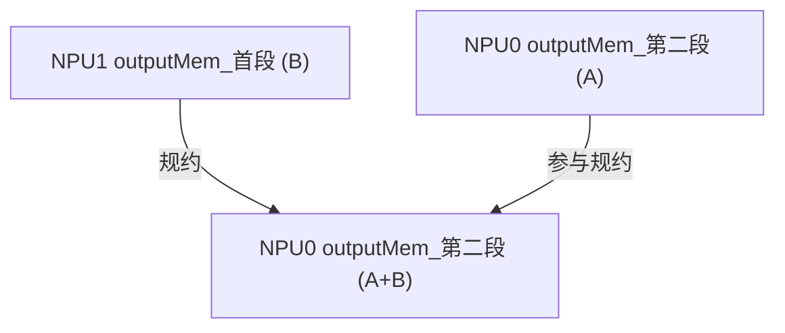


> 在 `RunAllReduceHDOptim` 的 for 循环里：
>
> ```cpp
> for (u32 step = 1; step <= nSteps; step++) {
>  if ((step != nSteps) || (stepPow != rankSize)) {
>      dst = outputMem_.range(step * totalSize, totalSize);
>  } else {
>      dst = userMemOut.range(0, totalSize);
>  }
>  // ...
> }
> ```
>
> ---
>
 什么时候会走到 `dst = userMemOut.range(0, totalSize);`？
>
> - 只有在**最后一步**（step == nSteps）**且**（stepPow == rankSize）时，才会走到这句。
> - 也就是说，**只有在最后一次规约，并且rank数是2的幂**时，规约结果才会直接写到 userMemOut（最终输出buffer）。
>
> ---
>
 第一次规约时的 dst
>
> - 第一次规约（step=1），条件 `step != nSteps` 肯定成立，所以会走：
>
>   ```cpp
>   dst = outputMem_.range(step * totalSize, totalSize);
>   ```
>
> - 也就是**outputMem_ 的第二段**（step=1时，偏移totalSize）。
>
> ---
>
 你看到的 `dst = userMemOut.range(0, totalSize);` 是**最后一步**的情况
>
> - 这时规约结果直接写到最终输出buffer（userMemOut），而不是outputMem_的某一段。
>
> ---
>
 总结
>
> - **第一次规约**：dst 指向 outputMem_ 的第二段（不是 userMemOut）。
> - **最后一次规约**（step==nSteps 且 stepPow==rankSize）：dst 指向 userMemOut（最终输出）。
> - 你看到的 `dst = userMemOut.range(0, totalSize);` 只在最后一步才会用到。
>
> ---
>
 图示
>
> ```mermaid
> flowchart TD
>     subgraph 第一次规约
>         A1["outputMem_首段"] -->|src| Reduce1
>         B1["outputMem_第二段"] -->|dst| Reduce1
>         Reduce1["HcclReduceAsync: 规约结果写回outputMem_第二段"]
>     end
>     subgraph 最后一次规约
>         A2["outputMem_某段"] -->|src| Reduce2
>         B2["userMemOut"] -->|dst| Reduce2
>         Reduce2["HcclReduceAsync: 规约结果写回userMemOut"]
>     end
> ```
>
> 

# 内存分段的作用

内存中分了若干段，这些段其实是一片内存用指针定位

### 第一段的来源

- 在 RunPreCopy 阶段，`outputMem_.range(0, totalSize)`（第一段）被用来存放**本地输入数据的拷贝**。
- 也就是说，最初 outputMem_ 的第一段 = 本NPU的 userMemIn。

### 第一段的用途

### 作为后续规约的“输入源”

- 在后续的规约步骤中，**邻居NPU会通过通信链路读取本NPU outputMem_ 的第一段**，把它作为规约的输入。
- 也就是说，**本NPU outputMem_ 的第一段，实际上是“被邻居用来做规约”的数据源**。

### 本地不再直接用

- 本NPU自己在规约时，**用的是 outputMem_ 的第二段、第三段...**，每一步都写到新的段。
- 本NPU outputMem_ 的第一段，**本地一般不会再直接用**，而是“为邻居提供数据”。

3. 数据流动举例（4NPU，第一次规约）

- NPU0 outputMem_ 第一段（A）会被 NPU1 读取，和 NPU1 的 outputMem_ 第二段（B）做规约。
- 同理，NPU1 outputMem_ 第一段（B）会被 NPU0 读取，和 NPU0 的 outputMem_ 第二段（A）做规约。

### 图示

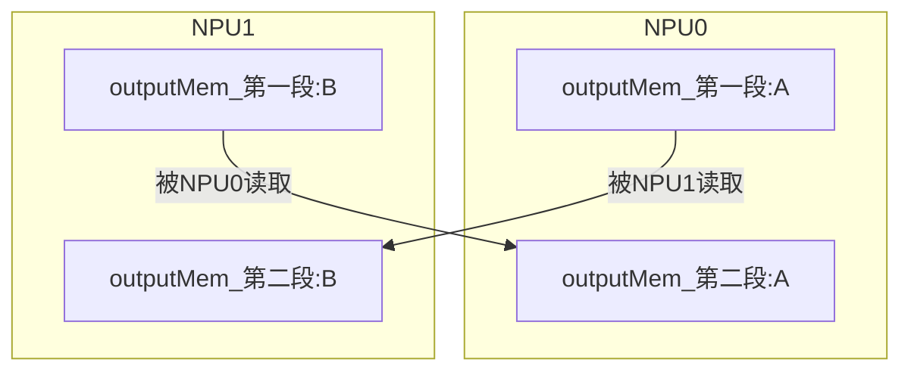

---

- 多段切片让每一步的数据流动互不干扰，便于调度和并发。

- 比如：

- 第一步规约写 outputMem_ 的第二段

- 第二步规约写 outputMem_ 的第三段

- ...依此类推

- 如果硬件/驱动支持多 stream 并行，理论上可以让多步规约在不同 stream、不同内存段上重叠执行，实现真正的流水线并行。

# stream的作用

## 主stream（stream_）的作用

### 主控/调度

- 主 stream 负责**调度整个 AllReduce 算法的主流程**，包括：
  - 各步规约的串行推进
  - 各种本地数据拷贝
  - 各步之间的同步与协调

### 本地操作/串行任务

- 很多**本地操作**（如本地内存拷贝、数据准备、最终结果写回 userMemOut）都是在主 stream 上执行的。
- 这些操作通常不需要并行，或者需要和所有子 stream 同步后再执行。

### 信号同步的主控方

- 主 stream 负责和子 stream 之间的同步（如 MainRecordSub、MainWaitSub 等），确保多 stream 并行任务的正确时序。
- 例如：主 stream 先发信号，子 stream 执行任务，主 stream 等待所有子 stream 完成后再推进下一步。

### 作为“默认流”

- 在很多异步计算/通信框架中，主 stream 是“默认流”，所有没有特别指定 stream 的操作都会在主 stream 上执行。
- 这样可以保证主流程的串行性和可控性。

### 代码举例

- 你会看到很多本地操作、同步操作都是用 `stream_` 作为参数传递的：

  ```cpp
  CHK_RET(HcclD2DMemcpyAsync(dispatcher_, dst, src, stream_));
  CHK_RET(LocalNotify::Wait(stream_, dispatcher_, ...));
  ```

- 而子 stream 只在需要并行/异步通信时才用到。

图示

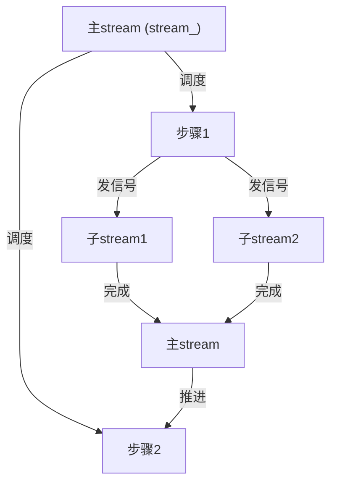

总结

- **主 stream 是整个 AllReduce 算法的“主控流”**，负责主流程推进、本地操作、全局同步。
- **子 stream 是“并行流”**，负责单方向/分组的通信和规约，实现并发。
- 主 stream 和子 stream 协同工作，既保证了并行性能，又保证了流程的正确性和可控性。

---

## 子流

### 子流的典型用法场景

在 AllReduceHDOptim 代码中，**子流（meshStreams_）主要用于多方向/多分组的并行通信和规约**。  
比如在 `RunBetweenStep`、`RunAllReduceHDOptim` 等函数中，部分通信/拷贝/规约操作会分配到不同的子流上。

---

### 代码片段举例

以 `RunBetweenStep` 为例（部分伪代码，突出子流用法）：

```cpp
src = outputMem_.range(step * totalSize, totalSize);
if ((step == (nSteps - 1)) && (static_cast<u32>(pow(base, nSteps)) == rankSize)) {
    dst = userMemOut.range(0, totalSize);
} else {
    dst = outputMem_.range((step + 1) * totalSize, totalSize);
}
// 这里用到子流
CHK_RET(HcclD2DMemcpyAsync(dispatcher_, dst, src, aicpu_ ? stream_ : meshStreams_[0]));

CHK_RET(links[neighNext]->TxAck(aicpu_ ? stream_ : meshStreams_[1]));
CHK_RET(links[neighNext]->RxAck(aicpu_ ? stream_ : meshStreams_[1]));
```

---

### 例子说明（以4NPU为例）

假设 base=2，meshStreams_ 有2个子流：meshStreams_[0]、meshStreams_[1]。

#### 场景：第二步规约（step=2）

- 需要同时和两个方向的邻居通信（比如左邻居、右邻居）。
- 为了并行推进，**把和左邻居的通信放到 meshStreams_[0]，和右邻居的通信放到 meshStreams_[1]**。

#### 具体操作

- **本地数据拷贝/规约**：用 meshStreams_[0] 执行

  ```cpp
  HcclD2DMemcpyAsync(dispatcher_, dst, src, meshStreams_[0]);
  ```

- **和右邻居的同步/通信**：用 meshStreams_[1] 执行

  ```cpp
  links[neighNext]->TxAck(meshStreams_[1]);
  links[neighNext]->RxAck(meshStreams_[1]);
  ```

#### 这样做的好处

- 两个方向的通信/规约可以**同时在不同 stream 上异步进行**，互不阻塞，提升并行度和带宽利用率。

---

### 图示

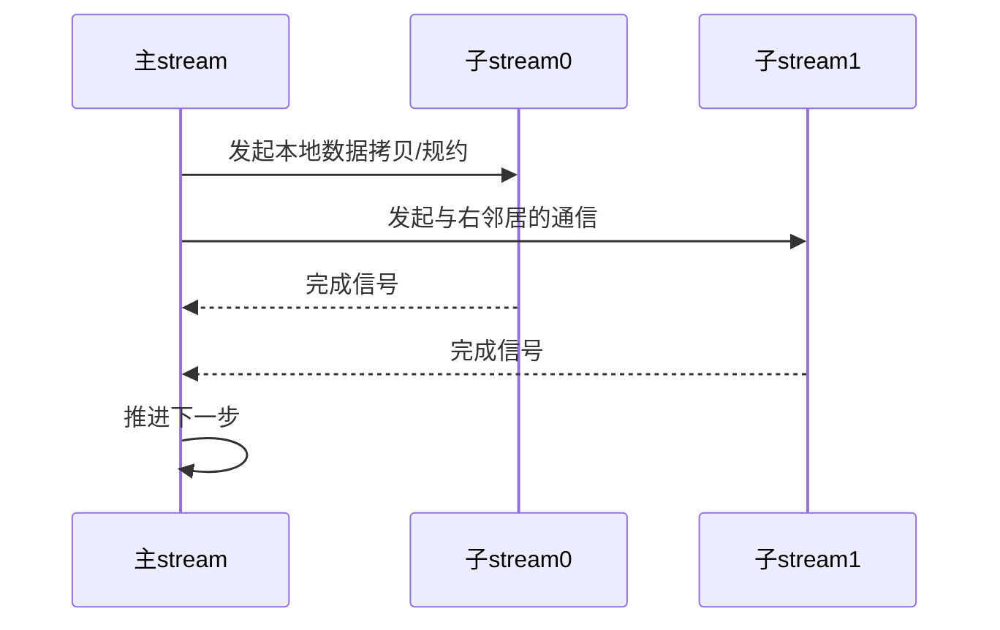

---


你的理解很细致，也非常接近实际！  
我们来**澄清主stream和子stream的分工**，并解答你关于“本地没拷贝完，子stream是不是没法启动”的性能困惑。

### 主stream和子stream的分工澄清

- **主stream（stream_）**：  
  主要负责本地数据的准备、拷贝、主流程调度和全局同步。
  - 例如：userMemIn → outputMem_ 的本地拷贝，通常在主stream上完成。
  - 还负责发起/等待所有子stream的同步信号，推进主流程。

- **子stream（meshStreams_[0]、meshStreams_[1]）**：  
  主要负责与左右邻居的通信和规约操作，实现并行。
  - meshStreams_[0] 可能负责“左邻居”方向的通信/规约
  - meshStreams_[1] 可能负责“右邻居”方向的通信/规约

#### 代码举例（更准确的分工）

```cpp
// 本地数据拷贝（主stream）
CHK_RET(HcclD2DMemcpyAsync(dispatcher_, dst, src, stream_));

// 与左邻居通信（子stream0）
CHK_RET(links[leftNeigh]->TxAck(meshStreams_[0]));
CHK_RET(links[leftNeigh]->RxAck(meshStreams_[0]));

// 与右邻居通信（子stream1）
CHK_RET(links[rightNeigh]->TxAck(meshStreams_[1]));
CHK_RET(links[rightNeigh]->RxAck(meshStreams_[1]));
```

---

### 性能困惑解答：本地没拷贝完，子stream能否启动？

#### 理论上

- **如果子stream的操作依赖于本地拷贝的结果**（比如 outputMem_ 的某段），那么必须等本地拷贝完成后，子stream才能安全启动。
- 这就需要**主stream和子stream之间有同步/信号机制**，确保数据依赖关系不被破坏。

#### 实际实现

- 代码中通常会有如下同步机制：
  - 主stream完成本地拷贝后，发信号（如 LocalNotify::Post）
  - 子stream等待信号（如 LocalNotify::Wait），收到信号后才开始通信/规约
- 这样可以保证**数据依赖被正确管理**，但也意味着**子stream的启动会被本地拷贝的完成所阻塞**。

#### 性能影响

- 如果本地拷贝很快（如NPU内部DMA），这部分阻塞很短，整体性能影响较小。
- 如果本地拷贝慢，确实会拖慢子stream的启动，影响并行度。
- **理想的流水线并行**，是让本地拷贝和通信/规约能最大程度重叠，但前提是数据依赖允许。

---

### 图示

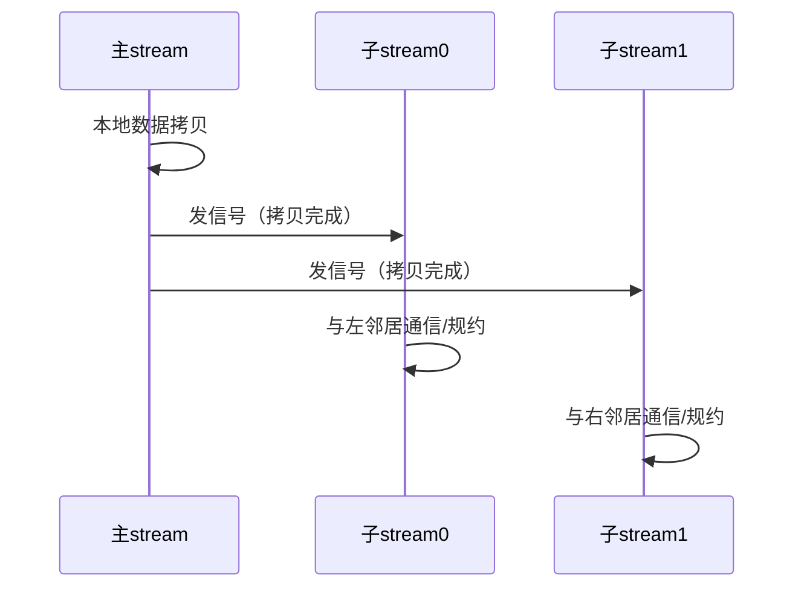

---

### 总结

- **主stream负责本地数据准备和全局调度，子stream负责并行的方向性通信/规约。**
- **子stream的启动通常依赖于主stream完成本地拷贝后的信号**，这保证了数据正确性，但也可能带来性能上的串行瓶颈。
- **优化方向**：尽量让本地拷贝和通信/规约重叠，减少阻塞，提升并行度。

非常棒！下面我以“**七、signal**”为一级标题，  
用**代码+图文**详细讲解 AllReduceHDOptim 中的信号（signal）机制。

---

# signal

## 信号机制的作用

- **信号（signal）机制**用于**主stream和子stream之间的同步**，确保数据依赖关系正确、并行任务有序推进。
- 典型场景：主stream完成本地拷贝后，通知子stream可以开始通信/规约；子stream完成后，通知主stream可以推进下一步。

---

## 相关数据结构

- `meshSignal_`、`meshSignalAux_`：  
  `std::vector<std::shared_ptr<LocalNotify>>`，每个stream配一个signal对象。
- `LocalNotify::Post`：主stream/子stream发信号（通知“我完成了”）。
- `LocalNotify::Wait`：主stream/子stream等待信号（等待“你完成了”）。

---

## 典型代码片段

### 主stream通知子stream（Post信号）

```cpp
// 主stream发信号，通知所有子stream可以开始
for (u32 signalIndex = 0; signalIndex < streamNum; signalIndex++) {
    CHK_RET(LocalNotify::Post(
        stream_,                  // 当前stream（主stream）
        dispatcher_,              // 调度器对象
        (*meshSignalAux_)[signalIndex], // 信号对象，通常与子stream一一对应
        profilerInput_.stage      // 当前profiling阶段（可用于调试/性能分析）
    ));
}
```

- **stream_**：主stream

- **dispatcher_**：调度器

- **(*meshSignalAux_)[signalIndex]**：第 signalIndex 个信号对象（给子stream用）

  > ## meshSignalAux_ 和 meshStreams_ 的一一对应关系
  >
  > ### 1. 初始化与传递
  >
  > - 在 AllReduceHDOptim 的 `Prepare` 函数中，`meshStreams_` 和 `meshSignalAux_` 都是作为参数传进来的，通常在外部初始化时就已经一一对应好。
  >
  > - 例如：
  >
  >   ```cpp
  >   HcclResult AllReduceHDOptim::Prepare(
  >       u64 reduceAttrBitMap,
  >       std::vector<Stream> &meshStreams,
  >       std::vector<std::shared_ptr<LocalNotify>> &meshSignal,
  >       std::vector<std::shared_ptr<LocalNotify>> &meshSignalAux,
  >       u32 userRank,
  >       HcomCollOpInfo *opInfo,
  >       bool aicpu)
  >   {
  >       // ...
  >       meshStreams_ = meshStreams;
  >       meshSignalAux_ = &meshSignalAux;
  >       // ...
  >   }
  >   ```
  >
  > - 这意味着**meshStreams_ 和 meshSignalAux_ 的下标是严格一一对应的**：  
  >
  >   - meshStreams_[0] <-> meshSignalAux_[0]  
  >   - meshStreams_[1] <-> meshSignalAux_[1]  
  >   - 以此类推
  >
  > ---
  >
  > ### 2. 对应关系的实际意义
  >
  > - **每个子stream负责一个方向/分组的通信/规约**，它需要有一个专属的信号对象来和主stream同步。
  > - 例如：
  >   - meshStreams_[0] 负责“左邻居”方向，meshSignalAux_[0] 就是主stream和这个方向的子stream之间的同步信号。
  >   - meshStreams_[1] 负责“右邻居”方向，meshSignalAux_[1] 就是主stream和这个方向的子stream之间的同步信号。
  >
  > ---
  >
  > ### 3. 代码中的典型用法
  >
  > ```cpp
  > for (u32 i = 0; i < meshStreams_.size(); i++) {
  >     // 主stream发信号给第i个子stream
  >     LocalNotify::Post(stream_, dispatcher_, (*meshSignalAux_)[i], profilerInput_.stage);
  > 
  >     // 第i个子stream等待自己的信号
  >     LocalNotify::Wait(meshStreams_[i], dispatcher_, (*meshSignalAux_)[i], profilerInput_.stage);
  > }
  > ```
  >
  > - 这里的 `i` 保证了 meshStreams_ 和 meshSignalAux_ 的一一对应。
  >
  > ---
  >
  > ### 4. 初始化时的保证
  >
  > - 在外部初始化时，通常会这样写（伪代码）：
  >
  >   ```cpp
  >   std::vector<Stream> meshStreams = {streamA, streamB};
  >   std::vector<std::shared_ptr<LocalNotify>> meshSignalAux = {signalA, signalB};
  >   // 保证streamA <-> signalA, streamB <-> signalB
  >   allReduceHdOptim->Prepare(..., meshStreams, ..., meshSignalAux, ...);
  >   ```
  >
  > ---
  >
  > ### 5. 图示
  >
  > ```mermaid
  > flowchart TD
  >     subgraph 子stream与信号一一对应
  >         meshStreams_0["meshStreams_[0] (左方向)"] <--> meshSignalAux_0["meshSignalAux_[0]"]
  >         meshStreams_1["meshStreams_[1] (右方向)"] <--> meshSignalAux_1["meshSignalAux_[1]"]
  >     end
  > ```
  >
  > ---
  >
  > ## 总结
  >
  > - **meshSignalAux_ 和 meshStreams_ 的下标严格一一对应**，每个子stream有自己专属的信号对象用于与主stream同步。
  > - 这种设计保证了多方向/多分组的并行通信和同步不会混淆，代码实现也更简洁安全。

- **profilerInput_.stage**：profiling阶段

---

### 子stream等待主stream（Wait信号）

```cpp
// 子stream等待主stream信号，收到后才开始
for (u32 streamIndex = 0; streamIndex < streamNum; streamIndex++) {
    CHK_RET(LocalNotify::Wait(
        meshStreams_[streamIndex],      // 当前子stream
        dispatcher_,                    // 调度器对象
        (*meshSignalAux_)[streamIndex], // 对应的信号对象
        profilerInput_.stage            // profiling阶段
    ));
}
```

- **meshStreams_[streamIndex]**：第 streamIndex 个子stream
- **(*meshSignalAux_)[streamIndex]**：与该子stream对应的信号对象

---

### 子stream完成后通知主stream（Post信号）

```cpp
// 子stream发信号，通知主stream“我完成了”
for (u32 streamIndex = 0; streamIndex < streamNum; streamIndex++) {
    CHK_RET(LocalNotify::Post(
        meshStreams_[streamIndex],  // 当前子stream
        dispatcher_,                // 调度器对象
        (*meshSignal_)[streamIndex],// 对应的信号对象（主stream用来等待）
        profilerInput_.stage        // profiling阶段
    ));
}
```

- **(*meshSignal_)[streamIndex]**：主stream等待的信号对象

---

### 主stream等待所有子stream完成（Wait信号）

```cpp
// 主stream等待所有子stream完成
for (u32 signalIndex = 0; signalIndex < streamNum; signalIndex++) {
    CHK_RET(LocalNotify::Wait(
        stream_,                  // 主stream
        dispatcher_,              // 调度器对象
        (*meshSignal_)[signalIndex], // 对应的信号对象
        profilerInput_.stage      // profiling阶段
    ));
}
```

---

### 代码中信号机制的实际用法（以 MainRecordSub 和 SubWaitMain 为例）

#### 主stream发信号，子stream等待

```cpp
// 主stream发信号
HcclResult AllReduceHDOptim::MainRecordSub(u32 streamNum) {
    if(aicpu_) return HCCL_SUCCESS;
    for (u32 signalIndex = 0; signalIndex < streamNum; signalIndex++) {
        CHK_RET(LocalNotify::Post(stream_, dispatcher_, (*meshSignalAux_)[signalIndex], profilerInput_.stage));
    }
    return HCCL_SUCCESS;
}

// 子stream等待信号
HcclResult AllReduceHDOptim::SubWaitMain(u32 streamNum) {
    if(aicpu_) return HCCL_SUCCESS;
    for (u32 streamIndex = 0; streamIndex < streamNum; streamIndex++) {
        CHK_RET(LocalNotify::Wait(meshStreams_[streamIndex], dispatcher_, (*meshSignalAux_)[streamIndex], profilerInput_.stage));
    }
    return HCCL_SUCCESS;
}
```

#### 用法流程

1. 主stream调用 `MainRecordSub`，对每个子stream的信号对象 `Post`。
2. 子stream调用 `SubWaitMain`，对每个信号对象 `Wait`，收到信号后才开始执行通信/规约。
3. 反向同步时，子stream `Post`，主stream `Wait`，实现“所有子stream完成后主stream再推进”。

---

## 图示：信号同步流程

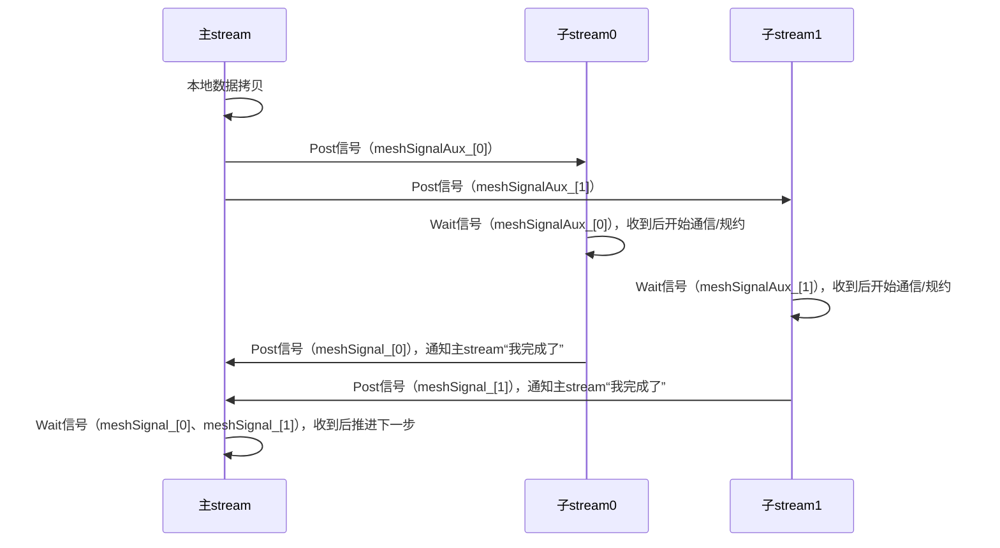

---

## profilerInput_.stage 的作用

### 变量来源

- `profilerInput_` 是 AllReduceHDOptim（继承自基类）的成员变量，类型通常为 `StepData` 或类似结构体。
- 其中的 `stage` 字段用于标记当前操作属于 AllReduce 算法的哪个阶段（step）。

---

### 在信号机制中的用途

- 在调用 `LocalNotify::Post` 和 `LocalNotify::Wait` 时，传入 `profilerInput_.stage`，可以**为每一次信号操作打上“阶段标签”**。
- 这样做的好处是：  
  - 在 profiling 工具或日志中，可以精确知道每个信号/同步操作发生在 AllReduce 的哪个阶段。
  - 便于后续性能分析、调试和瓶颈定位。

---

### 代码示例

```cpp
CHK_RET(LocalNotify::Post(
    stream_, dispatcher_, (*meshSignalAux_)[signalIndex], profilerInput_.stage));
```

- 这里的 `profilerInput_.stage` 可能是 step1、step2、copy、reduce 等等。

---

### profiling 的典型用途

- **性能分析**：统计每个阶段的耗时、等待时间、并发度等。
- **调试定位**：如果某个阶段卡住或异常，可以通过 stage 快速定位问题。
- **可视化**：配合 profiling 工具，可以生成 AllReduce 各阶段的时序图、火焰图等。

---

### 图示

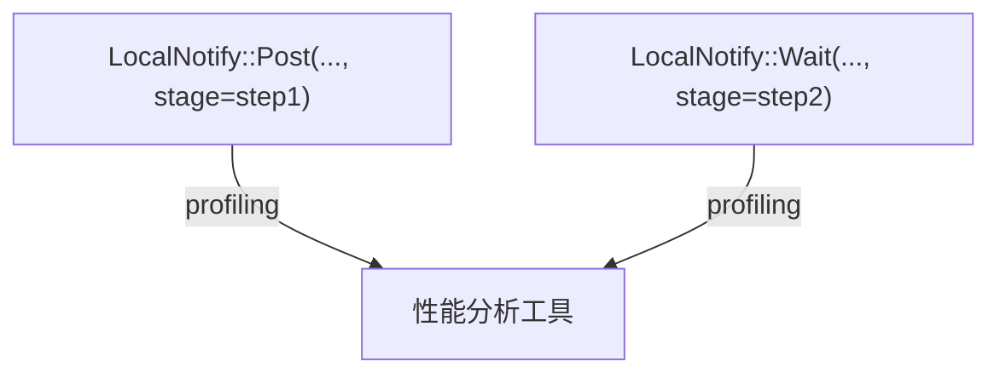

---

## profilerInput_.stage 的自定义性

### 设计目的

- `profilerInput_.stage` 作为 profiling/调试的“阶段标记”，本质上就是为了让开发者/框架**灵活标记当前操作属于哪个阶段**。
- 这样可以让 profiling 工具、日志、调试输出等更有针对性和可读性。

---

### 如何自定义

- 你可以在 AllReduce 算法的不同阶段、不同函数、不同操作前**手动设置 profilerInput_.stage 的值**。

- 例如：

  ```cpp
  profilerInput_.stage = 1; // 标记为“本地拷贝阶段”
  // ...本地拷贝代码...
  profilerInput_.stage = 2; // 标记为“第一次规约阶段”
  // ...第一次规约代码...
  profilerInput_.stage = 3; // 标记为“第二次规约阶段”
  // ...第二次规约代码...
  ```

- 你也可以用更语义化的枚举或常量，比如

  ```cpp
  enum AllReduceStage {
      STAGE_COPY = 1,
      STAGE_REDUCE1 = 2,
      STAGE_REDUCE2 = 3,
      // ...
  };
  profilerInput_.stage = STAGE_COPY;
  ```

---

### 代码中的典型用法

- 在每个阶段的入口处设置：

  ```cpp
  profilerInput_.stage = STAGE_COPY;
  MainRecordSub(...);
  
  profilerInput_.stage = STAGE_REDUCE1;
  SubWaitMain(...);
  ```

- 这样，所有用到 `profilerInput_.stage` 的信号/同步/日志操作都会带上你自定义的标记。

---

### profiling 工具如何利用

- profiling 工具或日志分析脚本可以根据 stage 的不同值，**统计每个阶段的耗时、并发度、等待时间等**，帮助你定位性能瓶颈。

---

## TxAck/RxAck 与 signal 的关系

### 这两行的本质

- `TxAck`（Transmit Acknowledge）和 `RxAck`（Receive Acknowledge）是**点对点通信链路上的同步/握手操作**。
- 它们的作用是：**确保本地和远端在某一步操作前后达成一致**，比如双方都准备好、可以开始数据传输或规约。

### 和 LocalNotify 的区别

- **LocalNotify::Post/Wait** 是**本地多stream之间的同步**（主stream和子stream之间的信号通知）。
- **TxAck/RxAck** 是**跨NPU（跨rank）之间的同步**，用于保证分布式通信的时序正确。

### 是否属于 signal 机制？

- **广义上讲**，它们都属于“同步/信号机制”的一部分，因为都是用来保证多线程/多进程/多设备之间的协作和时序。
- **狭义上讲**，TxAck/RxAck 更偏向于“网络通信协议的握手机制”，而 LocalNotify::Post/Wait 是“本地多stream的信号机制”。
- 在 AllReduceHDOptim 代码结构中，**TxAck/RxAck 主要用于rank间的同步，LocalNotify 主要用于本地stream间的同步**。

---

### 图示

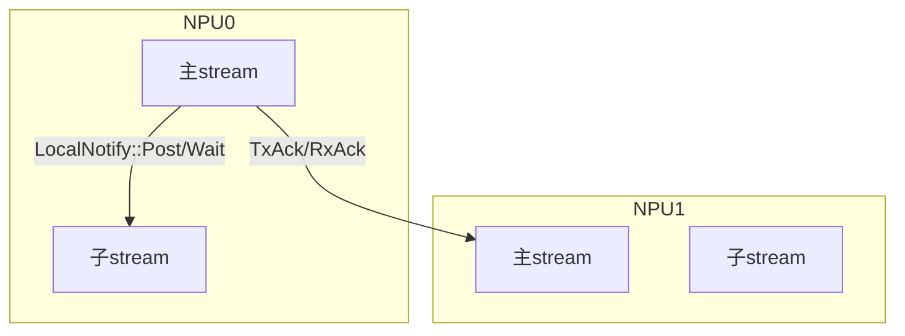

- **蓝色箭头**：本地信号（LocalNotify）
- **黑色箭头**：跨NPU同步（TxAck/RxAck）

---

### 总结

- `TxAck`/`RxAck` 是**跨NPU的同步信号**，属于分布式通信协议的同步机制。
- `LocalNotify::Post/Wait` 是**本地多stream的信号机制**。
- **两者都是“信号/同步机制”的一部分，但作用范围和实现层次不同。

你的问题非常专业！  
下面我会详细讲解**这两行代码的具体流程**，并给出**如何让子流与隔壁NPU做TxAck/RxAck的代码写法**。

---

## TxAck/RxAck 的具体流程

### 这两行代码的作用

```cpp
CHK_RET(links[neighCur]->TxAck(stream_));
CHK_RET(links[neighCur]->RxAck(stream_));
```

- **TxAck**：本NPU通过通信链路（links[neighCur]）向邻居NPU发送一个“我准备好了”的ack信号。
- **RxAck**：本NPU等待从邻居NPU收到一个“你准备好了”的ack信号。

### 典型流程（以NPU0和NPU1为例）

假设 NPU0 和 NPU1 互为邻居：

1. **NPU0 执行 TxAck**：  
   - NPU0 在 stream_ 上向 NPU1 发送“我准备好了”的ack。
2. **NPU0 执行 RxAck**：  
   - NPU0 在 stream_ 上等待 NPU1 发送来的ack（NPU1也会执行TxAck）。
3. **只有双方都完成 TxAck/RxAck，才会进入下一步**，保证双方都已准备好，数据传输/规约不会出错。

### 底层实现（简化理解）

- TxAck 可能是发一个小的同步包/信号到对端。
- RxAck 可能是阻塞/轮询/事件等待，直到收到对端的ack包/信号。

---

明白！下面以“7.11. 主流、子流的同步与NPU之间的同步”为三级标题，  
**重点讲清楚：主流/子流的本地同步（LocalNotify）与NPU间同步（TxAck/RxAck）是如何配合的**，并用代码和图文说明。

---

### 主流、子流的同步与NPU之间的同步

#### 概念区分

- **主流/子流的本地同步**：  
  - 通过 `LocalNotify::Post/Wait` 实现，主stream和子stream之间互相通知/等待，保证本地多stream的数据依赖和并发安全。
- **NPU之间的同步**：  
  - 通过 `TxAck/RxAck`（以及 TxDataSignal/RxDataSignal 等）实现，保证不同NPU（rank）之间的通信/规约时序正确。

---

#### 典型流程（以4NPU为例）

##### 步骤1：主流完成本地数据准备

- 主stream（stream_）完成本地数据拷贝后，**通过 LocalNotify::Post 通知所有子stream**可以开始。

```cpp
// 主stream发信号给所有子stream
for (u32 i = 0; i < meshStreams_.size(); i++) {
    LocalNotify::Post(stream_, dispatcher_, (*meshSignalAux_)[i], profilerInput_.stage);
}
```

##### 步骤2：子流等待主流信号

- 每个子stream（meshStreams_[i]）**通过 LocalNotify::Wait 等待自己的信号**，收到信号后才开始与邻居NPU通信/规约。

```cpp
// 子stream等待主stream信号
for (u32 i = 0; i < meshStreams_.size(); i++) {
    LocalNotify::Wait(meshStreams_[i], dispatcher_, (*meshSignalAux_)[i], profilerInput_.stage);
}
```

##### 步骤3：子流与邻居NPU同步（TxAck/RxAck）

- 子stream与对应方向的邻居NPU进行点对点同步，**用自己的stream和对应的links**。

```cpp
// 子stream与邻居NPU同步
CHK_RET(links[leftNeigh]->TxAck(meshStreams_[0]));
CHK_RET(links[leftNeigh]->RxAck(meshStreams_[0]));
CHK_RET(links[rightNeigh]->TxAck(meshStreams_[1]));
CHK_RET(links[rightNeigh]->RxAck(meshStreams_[1]));
```

##### 步骤4：子流完成后通知主流

- 子stream完成通信/规约后，**通过 LocalNotify::Post 通知主stream**“我完成了”。

```cpp
// 子stream通知主stream
for (u32 i = 0; i < meshStreams_.size(); i++) {
    LocalNotify::Post(meshStreams_[i], dispatcher_, (*meshSignal_)[i], profilerInput_.stage);
}
```

##### 步骤5：主流等待所有子流完成

- 主stream通过 LocalNotify::Wait 等待所有子stream完成，收到信号后推进下一步。

```cpp
// 主stream等待所有子stream完成
for (u32 i = 0; i < meshStreams_.size(); i++) {
    LocalNotify::Wait(stream_, dispatcher_, (*meshSignal_)[i], profilerInput_.stage);
}
```

---

#### 图文流程

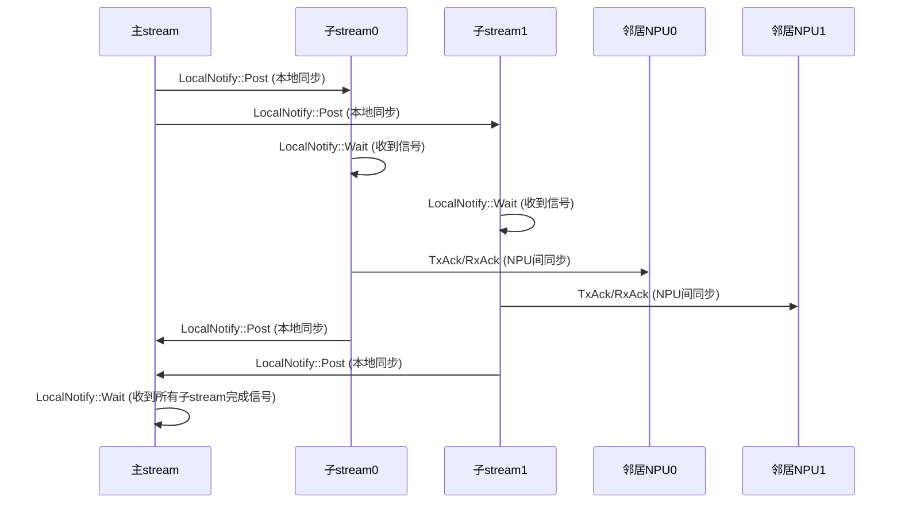

你的理解非常正确！  
**本地拷贝和信号同步的顺序**，就是保证数据依赖和并发安全的关键。  
**只要你把本地拷贝代码写在前面，信号（LocalNotify::Post）代码写在后面，就能保证“拷贝完成后才发信号”**，这样子流/其他任务就不会提前启动，数据不会出错。

---

## 如何保证同步的正确性

### 典型写法

```cpp
// 1. 本地数据拷贝（必须先完成）
CHK_RET(HcclD2DMemcpyAsync(dispatcher_, dst, src, stream_));

// 2. 拷贝完成后，发信号通知子stream可以开始
CHK_RET(LocalNotify::Post(stream_, dispatcher_, (*meshSignalAux_)[i], profilerInput_.stage));
```

- 这样写，**只有拷贝操作真正完成后，才会发信号**，子stream/其他依赖方在收到信号前不会启动。

---

### 子stream的等待

```cpp
// 子stream等待信号，只有收到信号后才会继续
CHK_RET(LocalNotify::Wait(meshStreams_[i], dispatcher_, (*meshSignalAux_)[i], profilerInput_.stage));
// ...后续通信/规约操作...
```

---

### 这样做的好处

- **数据依赖安全**：保证所有依赖本地拷贝结果的操作都在拷贝完成后才开始。
- **并发安全**：不会出现“数据还没准备好，子stream就开始用”的并发bug。
- **易于维护**：代码逻辑清晰，调试和性能分析也更容易。

---

### 图示

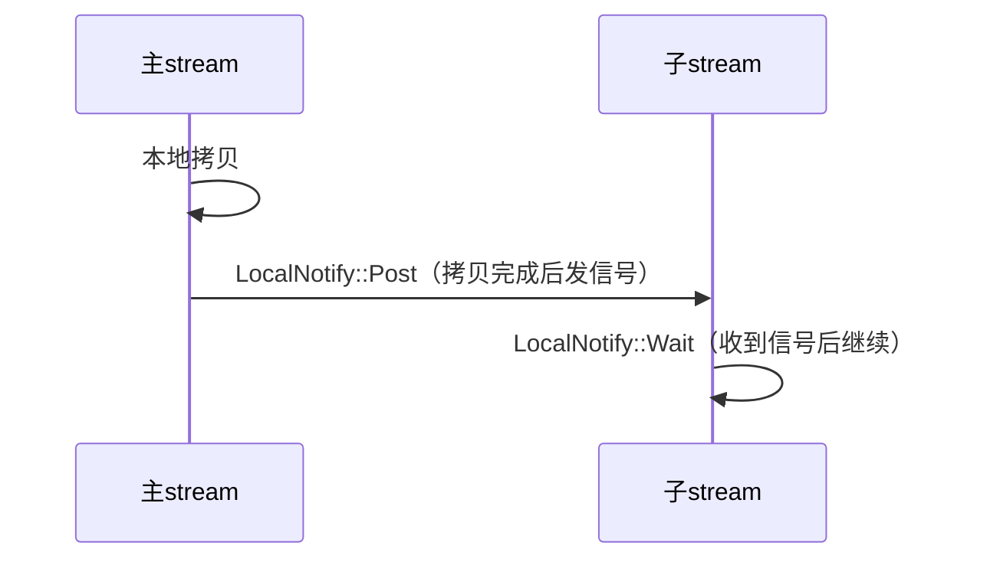

---

### 总结

- **只要把本地拷贝/计算代码写在前，信号代码写在后，就能保证同步的正确性。**
- 这种“先做事，后发信号”的模式，是并发/异步编程中最常见、最安全的同步方式。

你的思考非常细致！  
下面详细解答你的问题：

---

## base、子流、信号的关系

### base 至少为2，子流至少为2

- **base** 决定了每一步AllReduce涉及的“方向/分组”数。比如两个方向（一个子流一个方向）
- 代码中 `const u32 base = 2;`，所以**每个rank至少有2个子流（meshStreams_[0]、meshStreams_[1]）**，分别负责不同方向的并行通信。

---

### 主流和信号的关系

- **主流（stream_）**：只有一个，负责主流程调度和本地数据准备。
- **信号（signal）**：用于主流和每个子流之间的同步。

#### 绑定关系

- **每个子流都绑定一个信号对象**，用于和主流同步。
- 具体来说，主流和每个子流之间有一对信号（通常是 meshSignalAux_ 和 meshSignal_）：
  - 主流发信号（LocalNotify::Post）给子流，子流等待（LocalNotify::Wait）——通知子流可以开始。
  - 子流完成后发信号（LocalNotify::Post）给主流，主流等待（LocalNotify::Wait）——通知主流可以推进下一步。

#### 代码结构

```cpp
// 主流发信号给每个子流
for (u32 i = 0; i < base; i++) {
    LocalNotify::Post(stream_, dispatcher_, (*meshSignalAux_)[i], profilerInput_.stage);
}

// 每个子流等待自己的信号
for (u32 i = 0; i < base; i++) {
    LocalNotify::Wait(meshStreams_[i], dispatcher_, (*meshSignalAux_)[i], profilerInput_.stage);
}
```

- 这里的 `(*meshSignalAux_)[i]` 就是**主流和第i个子流之间的信号对象**。

---

### 主流本身不直接“绑定”信号

- 主流不是“拥有两个信号”，而是**和每个子流之间各有一个信号对象**，用于一对一同步。
- 这样设计可以灵活扩展到 base>2 的情况，每个方向/子流都能独立同步。

 图示

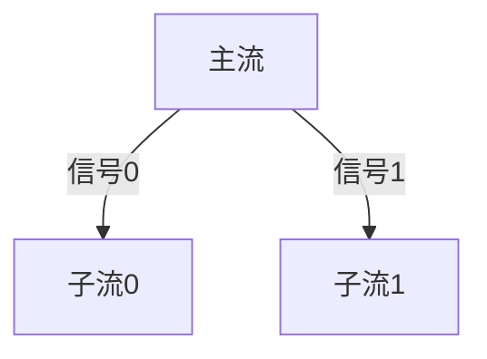

### meshSignalAux_ 和 meshSignal_ 的配对关系

1. 两组信号的作用

- **meshSignalAux_**：主流 → 子流的同步信号  
  - 主流完成本地准备后，`LocalNotify::Post` 给每个子流的 meshSignalAux_，子流 `LocalNotify::Wait`。
  - 作用：通知子流“可以开始了”。

- **meshSignal_**：子流 → 主流的同步信号  
  - 子流完成通信/规约后，`LocalNotify::Post` 给主流的 meshSignal_，主流 `LocalNotify::Wait`。
  - 作用：通知主流“我完成了”。

2. 代码配对示例

主流通知子流

```cpp
// 主流发信号给每个子流
for (u32 i = 0; i < base; i++) {
    LocalNotify::Post(stream_, dispatcher_, (*meshSignalAux_)[i], profilerInput_.stage);
}

// 子流等待主流信号
for (u32 i = 0; i < base; i++) {
    LocalNotify::Wait(meshStreams_[i], dispatcher_, (*meshSignalAux_)[i], profilerInput_.stage);
}
```

子流通知主流

```cpp
// 子流完成后发信号给主流
for (u32 i = 0; i < base; i++) {
    LocalNotify::Post(meshStreams_[i], dispatcher_, (*meshSignal_)[i], profilerInput_.stage);
}

// 主流等待所有子流完成
for (u32 i = 0; i < base; i++) {
    LocalNotify::Wait(stream_, dispatcher_, (*meshSignal_)[i], profilerInput_.stage);
}
```

3. 为什么要有两组信号？

- **meshSignalAux_** 用于“主流 → 子流”方向的同步（启动信号）。
- **meshSignal_** 用于“子流 → 主流”方向的同步（完成信号）。
- 这样可以实现**双向同步**，每个方向都能独立控制，避免死锁和竞态。

4. 图示

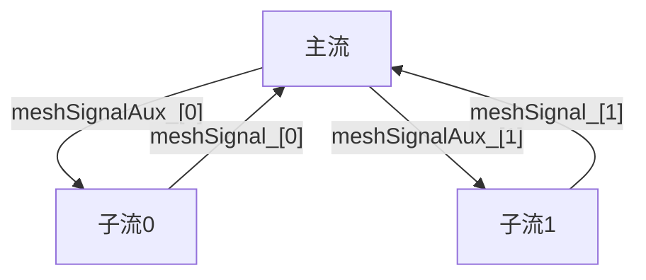

---

